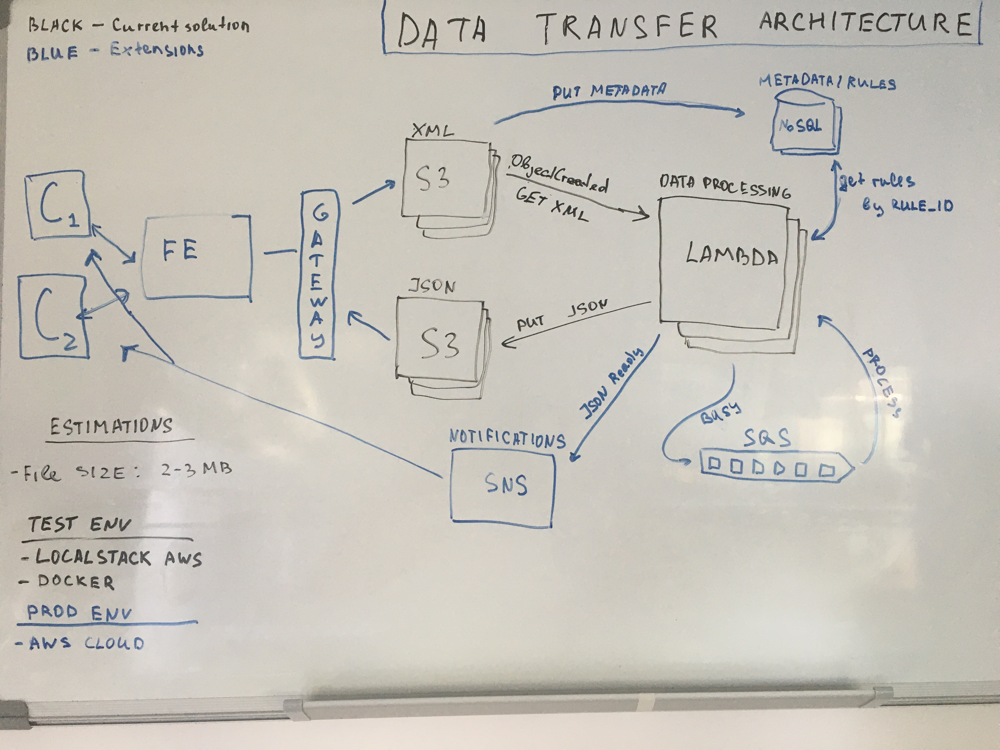

# Serverless - Data Transform

Serverless application that processes the data streams with S3, Dynamo DB and Lambda.
Data is stored on outbound S3 bucket, when a new object is created/uploaded/modified the Lambda is triggered. Lambda retrieves the object and process it, once processing is done the new object is uploaded to the inbound S3 bucket.

Processing is performed as follows:
XML files are converted to dictionary object, the data is processed according to the transformation rules, then the data is converted to JSON format

System Requirements:

----- the average file size is 2-3 MB, so this data can be loaded in memory and processed easily as nowadays lambdas could have up 10 GB RAM

----- user can upload a file for transformation using `POST` request calling `/upload` API GATEWAY endpoint

----- xml files/data are validated before saving to S3 or some other service does this job

----- transformation rules are defined by the customer or some other service does this job

----- transformation rules are stored as key:value objects in Dynamo DB and accessed by rule id

Future Extensions:

----- this architecture is able to handle any load as Lambdas are auto-scaled and can process async requests(Only AWS lambda hardware limits apply ~ 100 concurrent threads)

----- if traffic is too high SQS could be used to queue rate limited requests and lambda limits could be increased

----- UI should be added for users to upload their data without interacting with S3

----- once data is processed SNS could be used to notify the users about it

## Architecture Diagram
### Version 1

### Version 2

## Installing dependencies
- Python 3.x
- Pip
- Docker and Docker Compose
- Local AWS:

`pip install localstack`
- Optional, aws cli for locastack:

`pip install awscli-local`

https://github.com/localstack/localstack

## Set important env variables
I do not use `aws configure` for simplicity sake. Instead variable are set using `export` by shell script in `scripts/set-vars.sh`

Two required variables are below:

`export LOCALSTACK_HOSTNAME=localhost`  - For local machine use

`export LOCALSTACK_REMOTE=<localstack ip address>`   - For docker container use

In order to reach the localstack instance the ip has to be set correctly in env variables.
Make sure that the correct ip is set by checking the assigned ip with the following command `docker network inspect bridge`. The localstack instance ip will be displayed if it is currently up and running. This behavior has to be improved by obtaining the dynamic ip of locastack via docker compose with `- LOCALSTACK_HOSTNAME=${LOCALSTACK_REMOTE:-host.docker.internal}` config

## Running Application:
1. Execute the full CI/CD like pipeline. Two containers are created: 1. Localstack AWS 2. App - that executes the tests and deploys the applicaton code and invokes a test lambda function

`docker-compose up`

Note: when running the first time ever, it takes a while to download all images: localstack, python:3.8-alpine, lambci/lambda. The first lambda function call will be slow as well, as it needs to download an image for lambda

2. Run App in standby mode for manual testing.
- Build the image

`docker build -t serverless-test -f Dockerfile.test .`
- Starts the container and runs the basic setup scripts

`docker run --rm --env LOCALSTACK_HOSTNAME=<localstack ip address> -p 9001:8080 <image_id>`

Where `<localstack ip address>` is ip address of localstack container
- To run some manual tests, login to the docker

`docker exec -it <container_id> /bin/sh`

Set env variable to make sure everything in place

`. scripts/set-vars.sh`

- Put some objects to the bucket that triggers the lambda by `s3:ObjectCreated` event. 3 Lambda containers should be run in parallel

`aws --endpoint-url=$AWS_ENDPOINT s3 cp app/data s3://xml-data --recursive`

- Make post request via GATEWAY using a tool like `curl`

get api_id `aws --endpoint-url=$AWS_ENDPOINT --region=$AWS_REGION apigateway get-rest-apis`

`curl -X POST "$AWS_ENDPOINT/restapis/<api_id>/local/_user_request_/upload?file=data/data.xml&bucket=xml-data"`

- Also, it is possible to invoke the lambda manually. See scripts folder for details
```
chmod +x scripts/invoke-lambda.sh
. scripts/invoke-lambda.sh
```
- Verify processed file by downloading it from S3

`aws --endpoint-url=$AWS_ENDPOINT s3api get-object --bucket json-data --key data.json data.json`

- For tests:

`python3 -m pytest`

- Stop the container once done
